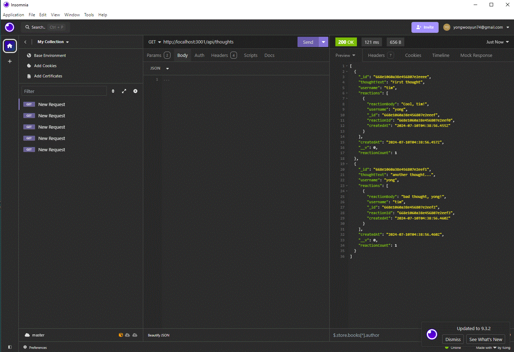
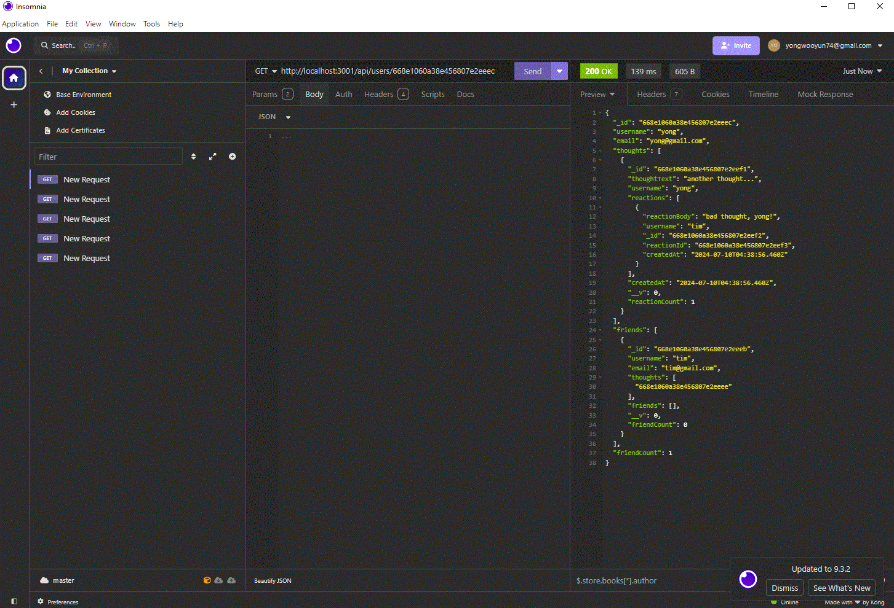
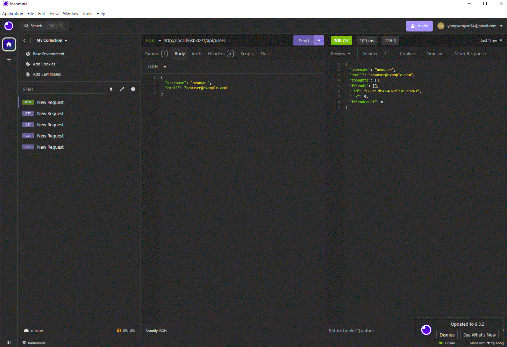
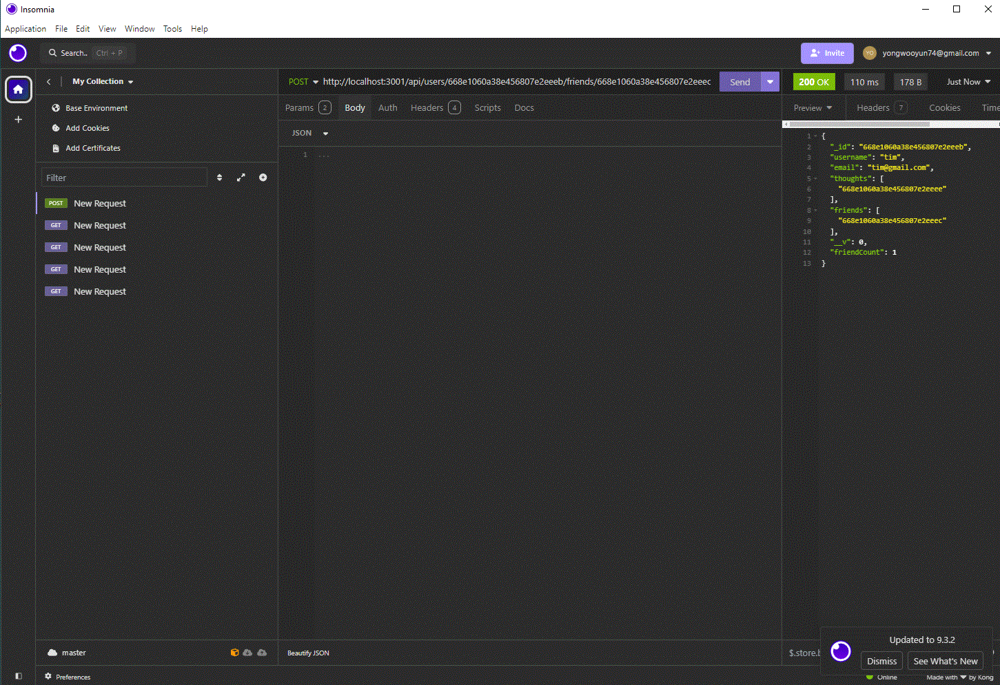

NoSQL Challenge: Social Network API

Github Link:
https://github.com/sagagi74/MongoDB_NoSQL_Social_Network_API
Youtube Link:
https://youtu.be/5j2KSRf1pqA

MongoDB is a popular choice for many social networks due to its speed with large amounts of data and flexibility with unstructured data

What this App does?

As a social media startup, we aim to develop an API for our social network utilizing a NoSQL database to efficiently manage large volumes of unstructured data. The API should start the server and sync Mongoose models to a MongoDB database upon invocation. It must support GET requests in Insomnia to retrieve user and thought data in formatted JSON, as well as POST, PUT, and DELETE requests to create, update, and delete users and thoughts. Additionally, it should handle POST and DELETE requests to manage reactions to thoughts and modify a user's friend list.

Technology unsed

MongoDB
Mongoose
Express.js
Node.js

MongoDB is a NoSQL database that stores data in flexible, JSON-like documents.

Mongoose is an Object Data Modeling (ODM) library for MongoDB and Node.js

Express.js is a fast and unopinionated web framework for Node.js.

Node.js is a JavaScript runtime built on Chrome's V8 JavaScript engine

1. GET routes to return all users and all thoughts being tested in Insomnia

2.  GET routes to return a single user and a single thought being tested in Insomnia

3. POST, PUT, and DELETE routes for users being tested in Insomnia

4.  POST and DELETE routes for a user’s friend list being tested in Insomnia

